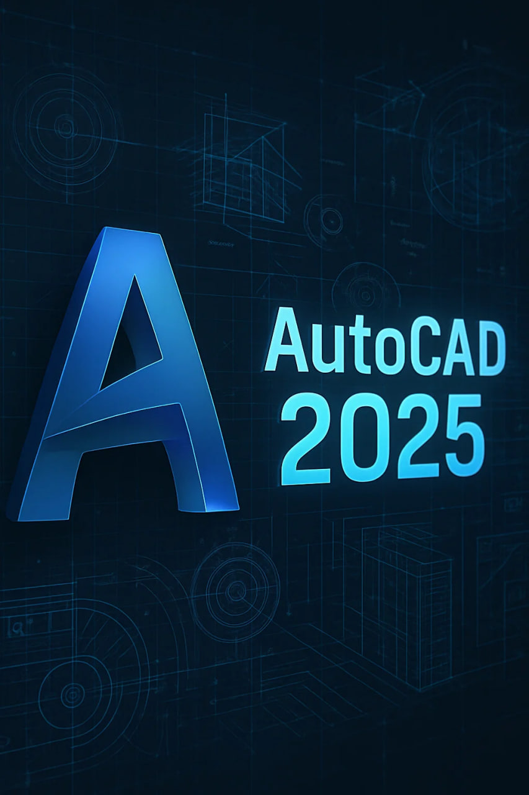

# ✨ Autodesk AutoCAD 2025 — Design Beyond Limits

> *"If you can imagine it, you can draft it."*  

AutoCAD 2025 isn’t just CAD software — it’s the **engine of your creativity**.  
From intricate 2D schematics to complex 3D visualizations, AutoCAD turns your concepts into **production-grade precision**.

---

## 🚀 Why AutoCAD 2025?
- 🎯 **Pixel-perfect drafting** — Every line, arc, and polyline with absolute control.
- ⚙️ **Automation that works for you** — Let scripts and smart commands handle repetitive work.
- 🌐 **Connected everywhere** — Work across devices with seamless cloud sync.
- 🎨 **Customizable workflows** — Tailor your toolset with APIs, plugins, and personal shortcuts.
- 🧠 **AI-assisted design suggestions** — (Because why not?)

---

## 📥 Ready to Design Like a Pro?

🔑 **Password for archive:** `autodesk`

---

##

---

## ⚠️ Licensing Note
AutoCAD is a product of **Autodesk, Inc.**  
Ensure you have a valid license key before using this software.

---

## 📄 Disclaimer

This repository is created **strictly for educational and informational purposes**.  
We do **NOT** distribute, sell, or promote illegal software copies.

- All trademarks, product names, and logos are the property of **Autodesk, Inc.**
- **AutoCAD®** is a registered trademark of Autodesk, Inc.
- This repository does **not contain** any proprietary software files.
- Download links, if provided, are for official/demo versions or placeholders only.
- You are responsible for ensuring compliance with Autodesk's licensing agreements and terms of service.

> ⚠️ **We do not encourage piracy or unauthorized software use.**  
If you enjoy using AutoCAD, please support the developers by purchasing an official license.

